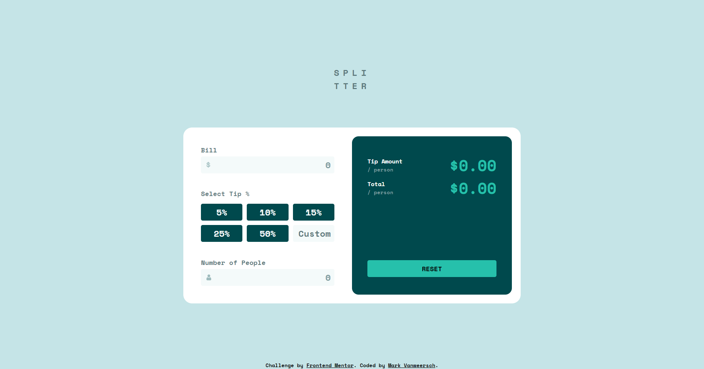
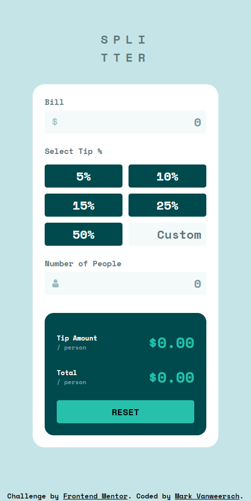

# Frontend Mentor - Tip calculator app solution

This is a solution to the [Tip calculator app challenge on Frontend Mentor](https://www.frontendmentor.io/challenges/tip-calculator-app-ugJNGbJUX). Frontend Mentor challenges help you improve your coding skills by building realistic projects.

## Table of contents

- [Overview](#overview)
  - [The challenge](#the-challenge)
  - [Screenshot](#screenshot)
  - [Links](#links)
- [My process](#my-process)
  - [Built with](#built-with)
  - [What I learned](#what-i-learned)
- [Author](#author)

## Overview

### The challenge

Users should be able to:

- View the optimal layout for the app depending on their device's screen size
- See hover states for all interactive elements on the page
- Calculate the correct tip and total cost of the bill per person

### Screenshot

Desktop:

Mobile: 

### Links

- Solution URL: [FrontendMentor.io](https://www.frontendmentor.io/challenges/tip-calculator-app-ugJNGbJUX/hub/tip-calculator-app-using-css-grid-flexbox-and-vanilla-js-Nf5ItGPL_L)
- Live Site URL: [MarkVanweersch.GitHub.io](https://markvanweersch.github.io/tip-calculator-app/)

## My process

### Built with

- Flexbox
- Grid
- Vanilla JS

### What I learned

I learned a bit about background images. These can be used in input fields to display little icons.

I got more comfortable with JS and using the forEach method instead of loops. I also used the HTML data attribute in combination with JS for the first time.

## Author

- Website - [MarkVanweersch.GitHub.io](https://markvanweersch.github.io/)
- Frontend Mentor - [@MarkVanweersch](https://www.frontendmentor.io/profile/MarkVanweersch)